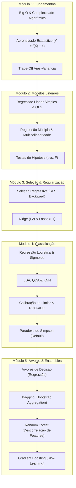

# 🧠 Mentoria em Machine Learning & Engenharia de ML

Repositório de estudos práticos e teóricos de **Machine Learning**, cobrindo os fundamentos matemáticos e estatísticos da obra canônica **ISLP (*An Introduction to Statistical Learning with Applications in Python*)**, implementações no ecossistema Python (`scikit-learn`, `statsmodels`, `pandas`) e tomadas de decisão orientadas a negócios.

---

## 🗺️ Estrutura da Trilha de Aprendizado



---

## 📚 Conteúdo por Módulo

### 1. Fundamentos & Teoria Geral
* **[Complexidade_O.ipynb](Complexidade_O.ipynb):** Análise assintótica de algoritmos (Big-O), custo computacional de treino vs. inferência em ML e preparação para entrevistas técnicas.
* **[cap1_ISLP.ipynb](cap1_ISLP.ipynb):** Introdução ao Aprendizado Estatístico, tipos de problemas e notação matricial.
* **[cap2_ISLP.ipynb](cap2_ISLP.ipynb):** Formulação de $Y = f(X) + \epsilon$, abordagens paramétricas vs. não paramétricas e decomposição matemática do erro (Viés, Variância e Erro Irredutível $\sigma^2$).
* **[docs/01_bias_variance_tradeoff.md](docs/01_bias_variance_tradeoff.md):** Guia conceitual sobre o dilema Viés-Variância.

### 2. Regressão Linear & Diagnóstico
* **[cap3_ISLP.ipynb](cap3_ISLP.ipynb):** Resumo didático e técnico detalhado do Capítulo 3 do ISLP (OLS, testes $t$ e $F$, resíduos, multicolinearidade, alavancagem e $R^2$).
* **[notebooks/01_regressao_linear.ipynb](notebooks/01_regressao_linear.ipynb):** Implementação completa em Python no dataset `Diabetes`:
  * Regressão simples com `bmi` vs. Regressão múltipla com 10 preditores.
  * Solução analítica (Equações Normais) vs. Numérica.
  * Interpretação de métricas (MAE, RMSE, $R^2$) e análise diagnóstica de resíduos.
* **[notebooks/exercicio_regracao_linear.ipynb](notebooks/exercicio_regracao_linear.ipynb):** Exercício prático complementar de regressão linear.
* **Documentação Teórica:**
  * [docs/02_regressao_linear_simples_ols.md](docs/02_regressao_linear_simples_ols.md): Minimização do RSS passo a passo e derivada igualada a zero.
  * [docs/03_regressao_linear_multipla.md](docs/03_regressao_linear_multipla.md): Notação matricial e multicolinearidade.
  * [docs/04_testes_t_e_f.md](docs/04_testes_t_e_f.md): Teste t para significância individual vs. Teste F para significância global.

### 3. Seleção de Modelos & Regularização (ISLP Cap. 6)
* **[notebooks/exercicio_regressao_linear_regularizacao.ipynb](notebooks/exercicio_regressao_linear_regularizacao.ipynb):**
  * Comparativo experimental entre **OLS Completo**, **SFS Backward (Seleção de Subconjuntos)**, **Ridge ($L_2$)** e **Lasso ($L_1$)**.
  * Busca de hiperparâmetros ótimos via Validação Cruzada (`RidgeCV` e `LassoCV`).
  * Visualização dos **Caminhos de Regularização (*Regularization Paths*)** mostrando a evolução dos coeficientes conforme $\alpha$ varia.
  * Combate real à multicolinearidade entre exames de sangue (`s1` vs `s2`): como o Lasso zerou a feature redundante enquanto o Ridge redistribuiu os pesos.
  * Validação cruzada K-Fold (5-Folds) com média e desvio padrão de $R^2$ e RMSE.

### 4. Classificação & Métricas de Negócio (ISLP Cap. 4)
* **[notebooks/02_regressao_logistica.ipynb](notebooks/02_regressao_logistica.ipynb):**
  * Por que a regressão linear falha para probabilidade (extrapolação e heterocedasticidade).
  * A função Sigmoide, o número de Euler ($e \approx 2{,}71828$) e estimação por Máxima Verossimilhança (MLE).
  * Impacto da escolha do **limiar de decisão (*threshold*)** na Matriz de Confusão (corte 0.50 vs 0.20 priorizando captura de risco/Recall).
  * Curva ROC e métrica AUC calculadas sobre dados reais de crédito (`Default`).
  * Comparativo multivariado: **Regressão Logística**, **LDA**, **QDA** e **KNN** (demonstrando o impacto crítico da padronização e de $K$).
  * Demonstração prática do **Paradoxo de Simpson (Paradoxo do Estudante)**: por que o coeficiente muda de sinal ao controlar pelo saldo devedor.
* **Documentação Teórica:**
  * [docs/05_regressao_logistica_e_sigmoide.md](docs/05_regressao_logistica_e_sigmoide.md): Sigmoide, Odds e Log-Odds calculados na mão.
  * [docs/06_matriz_confusao_e_roc_auc.md](docs/06_matriz_confusao_e_roc_auc.md): Matriz de Confusão, Recall, Precisão e Curva ROC.
  * [docs/07_comparativo_classificadores.md](docs/07_comparativo_classificadores.md): Comparação metodológica entre os 4 classificadores canônicos.

### 5. Modelos Baseados em Árvores & Ensembles (ISLP Cap. 8)
* **[notebooks/03_arvores_e_ensembles.ipynb](notebooks/03_arvores_e_ensembles.ipynb):**
  * **Árvore de Decisão Individual:** Partição recursiva do espaço de atributos e diagnóstico de alta variância ($R^2 \approx 0{,}60$).
  * **Bagging ($m = p$):** Redução da variância pela média de árvores geradas por bootstrap (corta o erro pela metade, $R^2 \approx 0{,}80$).
  * **Random Forest ($m < p$):** Descorrelação de árvores por sorteio aleatório de preditores a cada nó ($m \approx \sqrt{p}$ e $m = 6$).
  * **Gradient Boosting:** Aprendizado sequencial sobre resíduos (*slow learning*), sintonia da taxa de aprendizado ($\lambda = 0{,}10$) e curva de erro por iteração ($R^2 \approx 0{,}84$, MSE $= 0{,}21$).
  * **Importância das Variáveis (*Feature Importance*):** Identificação de `MedInc` e localização geográfica como drivers primários no dataset `California Housing`.

---

## ⚡ Consulta Rápida
* **[00_INDEX.md](00_INDEX.md):** Índice completo de estudo e revisão rápida de tópicos teóricos e práticos.
* **[01_cheatsheet.md](01_cheatsheet.md):** Fórmulas, notações matemáticas, termos estatísticos e checagens práticas de produção.

---

## 🛠️ Configuração do Ambiente Local

Recomenda-se utilizar Python 3.11+ em um ambiente virtual isolado:

```bash
# 1. Criação e ativação do ambiente virtual
python3 -m venv .venv
source .venv/bin/activate  # No Windows: .venv\Scripts\activate

# 2. Instalação dos pacotes principais
pip install numpy pandas scikit-learn statsmodels matplotlib seaborn jupyter

# 3. Inicialização do Jupyter Notebook
jupyter notebook
```

### Assistente Integrado (`assist.py`)
O repositório inclui um script CLI (`assist.py`) que se conecta à API dos modelos generativos Gemini para consultas rápidas e explicações de código:
```bash
python assist.py "Explique o trade-off viés-variância na regressão linear"
```
*(Requer chave `GEMINI_API_KEY` configurada no arquivo `.env`)*